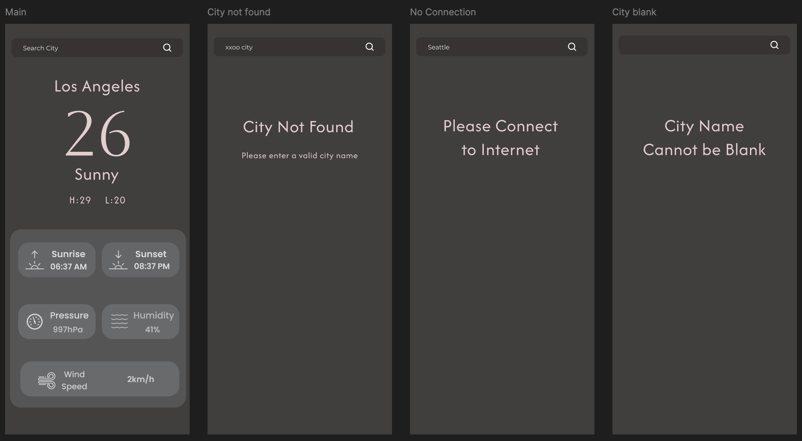

# WeatherApp

A modern Android application that displays real-time weather information using the OpenWeatherMap API. Built with Kotlin, the app supports city-based search and device geolocation, with clean UI design and robust error handling.


## Features

- **Current Location Weather**: Automatically fetches weather for your device's current location

- **City Search**: Search for weather information in any city around the world

- **Detailed Weather Data**: View comprehensive weather details including:
  - Current temperature
  - Weather conditions (sunny, cloudy, rainy, etc.)
  - High and low temperatures
  - Sunrise and sunset times
  - Wind speed
  - Atmospheric pressure
  - Humidity percentage

- **Error Handling**:
  - City not found
  - No internet connection
  - Empty city search
    

## UI Design
The user interface was designed in [Figma](https://www.figma.com/):




## Requirements

- Android SDK 35 or higher
- Internet access to fetch weather data
- Location permissions for current location weather
- OpenWeatherMap API key
- Figma (optional, for UI design reference)


## Setup Instructions

1.  Clone the repository
  
2.  Open the project in Android Studio
   
3.  Add your OpenWeatherMap API key:
    - In the project root, create a file named `local.properties` if it doesn't already exist
      
    - Add the following line (replace your_key_here with your actual API key):
      
      ```
      OPEN_WEATHER_API_KEY=your_key_here
      ```
    
4. Sync Gradle to apply changes

5. Build and run the app on an emulator or a physical device with internet access


## API Key

This app uses the [OpenWeatherMap API](https://openweathermap.org/api) to fetch weather data. To run the app, you'll need to:

- Sign up for an account at OpenWeatherMap
- Generate an API key
- Add it to the `local.properties` file as described in the setup instructions


## Permissions
The app requires the following permissions:

- `INTERNET`: To fetch weather data from the API
- `ACCESS_NETWORK_STATE`: To check network connectivity
- `ACCESS_FINE_LOCATION`: To get the device's current location
- `ACCESS_COARSE_LOCATION`: As a fallback for location services
